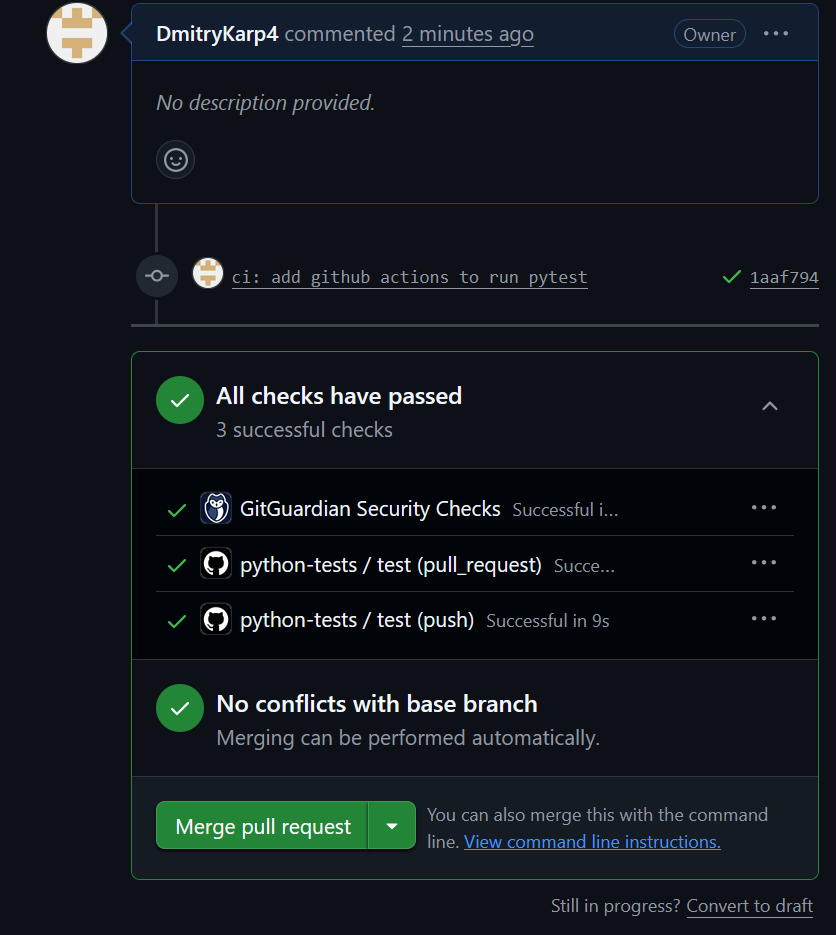

# CI report (GitHub Actions)

## 1) Что такое CI (своими словами)
CI - это практика, при которой код автоамтически п роверяется после некоторого действия. Система запускает сборку проекта и тесты, чтобы убедиться, что новые изменения не ломают уже существующий функционал.

## 2) Что проверяет ваш workflow
- Checkout - скачивает репозиторий в виртуальную среду runner'а
- Setup python - устанавливает python
- Install dependencies - обновляет pip и устанавливает pytest
- Run test - запускает тесты
- Срабатывает при push и pull_request

## 3) Ссылка на PR
(https://github.com/DmitryKarp4/ci_actions_lab/pull/1)


## 4) Что было красным и как вы починили
- Actions был провален лишь один раз, в самом начале после пуша репозитория на гитхаб. Ошибка заключалась в отсутствии модуля pytest. Было исправлено путем добавления обновления pip и установки этого модуля.

## 5) Команды
Вставь вывод:
```
 python -m pytest -q
..                                                                   [100%]
2 passed in 0.01s
```
```
git log --oneline --decorate --graph --all
*   b1a8eae (HEAD -> main, tag: v0.4, origin/main, origin/HEAD) Merge pull request #1 from DmitryKarp4/ci/actions
|\
| * 1aaf794 (origin/ci/actions, ci/actions) ci: add github actions to run pytest
|/
* d5d1339 chore: initial commit
```
```
git tag
v0.4
```

## 6) AI usage
- Объяснение test.yml
- Пояснения CI